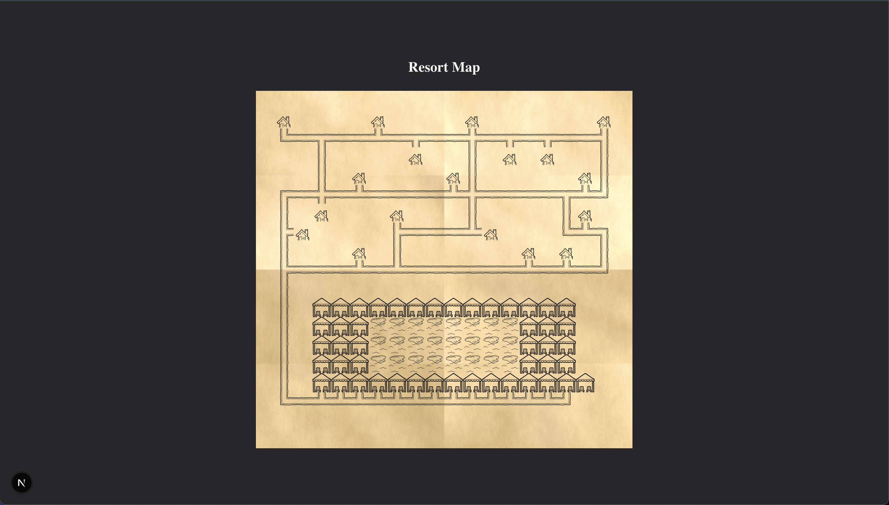

# Resort Map

A visual resort map application that renders ASCII art maps as interactive tile-based layouts. Guests can check in to cabanas by verifying their booking details.



## Running the Project

### Install dependencies

```bash
pnpm install
```

### Development server

**With default files** (uses `data/map.ascii` and `data/bookings.json`):

```bash
pnpm dev
```

**With custom files:**

```bash
pnpm dev -- --map ./path/to/your-map.ascii --bookings ./path/to/your-bookings.json
```

### Where to put your files

- **Map files:** Must be `.ascii` files using only these characters: `.` (empty), `c` (chalet), `#` (path), `W` (cabana), `p` (pool)
- **Bookings files:** Must be a JSON array of `{ "room": "...", "guestName": "..." }` objects

Place them anywhere and pass the path via `--map` / `--bookings`, or replace the defaults in the `data/` directory.

Check `data/new-map.ascii` for an alternative map layout example. The `data/invalid-map.ascii` and `data/invalid-bookings.json` files show what invalid inputs look like and are used in tests.

Both flags are optional and can be used independently. The startup script validates the provided files before launching the server — if validation fails, the server won't start and you'll see an error describing the issue.

## Running Tests

```bash
pnpm test           # Run all tests once
pnpm test:watch     # Run tests in watch mode
```

Test suites cover API route handlers, content validation, map-building logic (room numbering, path tile selection), and component rendering/interactions.

## Assumptions

- The bookings file only contains `room` and `guestName` — there are no coordinates (x, y) or explicit cabana assignments. Because of this, room numbers are assigned to cabanas sequentially from top to bottom, left to right as they appear in the map. This is the most intuitive mapping given the available data.
- The room number is automatically assigned based on which cabana the guest clicks — it is pre-filled and disabled in the check-in dialog. The only input the guest provides is their name (matched case-insensitively against the bookings file).

## Core Design Decisions

### Component structure

- **`components/ui/`** holds generic, reusable primitives (button, input, dialog, label) with basic styling — these have no domain logic.
- **`components/resort-map/`** is a feature folder grouping multiple related components (index, map-row, map-tile) that together form the map feature.
- **`components/booking-dialog.tsx`** lives at the top level of `components/` rather than in `ui/` because it contains its own business logic (form validation, API calls, error handling) — it's not a generic primitive.

### Route Handlers over Server Actions

Server Actions would arguably be a simpler fit for this use case, but the requirement was to expose a standalone API. That's why the backend uses Route Handlers (`app/api/`) instead.

### Custom hook for map logic

`use-resort-map.ts` extracts tile mapping, path tile selection, and room number assignment out of the components. This keeps the rendering components focused on presentation and makes the logic independently testable.

### Project structure

Dedicated top-level folders (`types/`, `data/`, `lib/`, `hooks/`) keep concerns separated and make the project easier to scale — rather than colocating everything under `app/`.

### Dual validation (CLI + runtime)

Files are validated both at startup (via `scripts/validate-user-files.ts` before the dev server launches) and at runtime in each API route. The startup check gives fast feedback when providing custom files. The runtime check guards against files changing on disk while the server is running.

## Tech Stack

- **Framework:** Next.js 16 (App Router) with React 19
- **Language:** TypeScript 5
- **Styling:** TailwindCSS 4
- **UI Components:** shadcn/ui, Base UI, Lucide icons
- **Notifications:** Sonner (toast)
- **Testing:** Vitest 4, Testing Library (React + user-event), jsdom
- **Package Manager:** pnpm
- **AI Tooling:** Claude Code (Opus 4.6), Gemini, Next.js MCP server (Context7)

## Backend

The backend consists of three API routes. All routes read data from the filesystem and validate file contents before responding.

### `GET /api/map`

Returns the ASCII map content.

- Reads the map file from the configured path (default: `data/map.ascii`)
- Validates that the file only contains allowed characters (`.`, `c`, `#`, `W`, `p`, `\n`)
- **200:** `{ map: string }`
- **400:** Invalid map content
- **500:** File read error

### `GET /api/bookings`

Returns all bookings and the list of already checked-in cabana numbers.

- Reads the bookings JSON file (default: `data/bookings.json`)
- Validates structure: non-empty array of `{ room: string, guestName: string }` objects
- Merges file data with in-memory session state (checked-in cabanas)
- **200:** `{ bookings: Booking[], bookedCabanas: number[] }`
- **400:** Invalid bookings content
- **500:** File read error

### `POST /api/book`

Checks a guest into a cabana.

- **Request body:** `{ room: string, guestName: string, cabanaNumber: number }`
- Validates the cabana is not already booked (in-memory Set)
- Matches `room` + `guestName` (case-insensitive) against the bookings file
- On success, adds the cabana to the in-memory booked set
- **200:** `{ message: string, cabanaNumber: number }`
- **400:** Missing required fields
- **404:** No matching booking found
- **409:** Cabana already booked
- **500:** Server error

### In-Memory State

Checked-in cabanas are tracked in a server-side `Set` (`app/api/_state.ts`). This state is session-scoped and resets when the server restarts.

## Folder Structure

```
resort-map/
├── app/
│   ├── api/
│   │   ├── _state.ts          # Global in-memory Set of booked cabanas
│   │   ├── book/route.ts      # POST - check-in endpoint
│   │   ├── bookings/route.ts  # GET  - list bookings
│   │   └── map/route.ts       # GET  - serve map content
│   ├── layout.tsx             # Root layout (fonts, theme, toaster)
│   ├── page.tsx               # Home page rendering ResortMap
│   └── globals.css
├── components/
│   ├── booking-dialog.tsx     # Check-in form dialog
│   ├── resort-map/
│   │   ├── index.tsx          # Main map component (data fetching, state)
│   │   ├── map-row.tsx        # Renders a single row of tiles
│   │   └── map-tile.tsx       # Individual tile (cabana/path/pool/chalet)
│   └── ui/                    # shadcn-style primitives (button, dialog, input, label, sonner)
├── hooks/
│   └── use-resort-map.ts      # TILE_MAP, getPathTile(), assignRoomNumbers()
├── lib/
│   ├── cli-paths.ts           # Resolves map/bookings file paths (env var support)
│   ├── content-validation.ts  # Validates map and bookings file contents
│   └── utils.ts               # cn() classname utility
├── types/
│   └── resort-map.ts          # Booking interface, ALLOWED_MAP_CHARS, BOOKING_KEYS
├── data/
│   ├── map.ascii              # Default ASCII map
│   ├── new-map.ascii          # Alternative map layout
│   ├── bookings.json          # Default bookings (120 guests, rooms 101-520)
│   ├── invalid-map.ascii      # Map with invalid chars (for testing)
│   └── invalid-bookings.json  # Bookings with extra properties (for testing)
├── scripts/
│   ├── run.sh                 # Dev startup script (parses CLI args, validates, starts server)
│   └── validate-user-files.ts # Pre-flight file validation
├── __tests__/                 # Vitest test suites (API, components, lib)
└── vitest.config.ts
```
